# Motel_Management

Website quản lý nhà trọ (Motel Management System)

---

## 📚 Kiến trúc & Tài liệu kỹ thuật (Architecture & Documentation)

### 1. Java Core Foundation

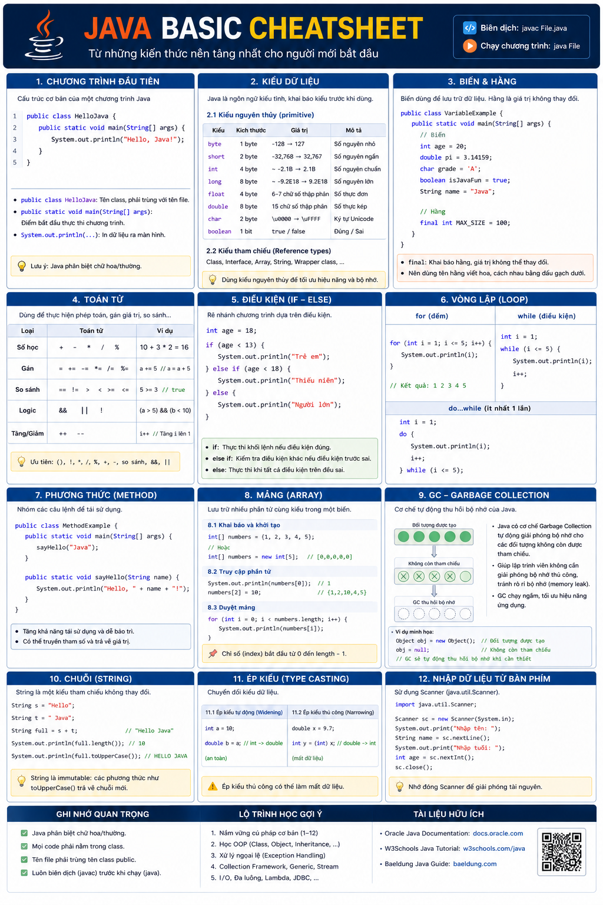
*Java Basic Concepts*

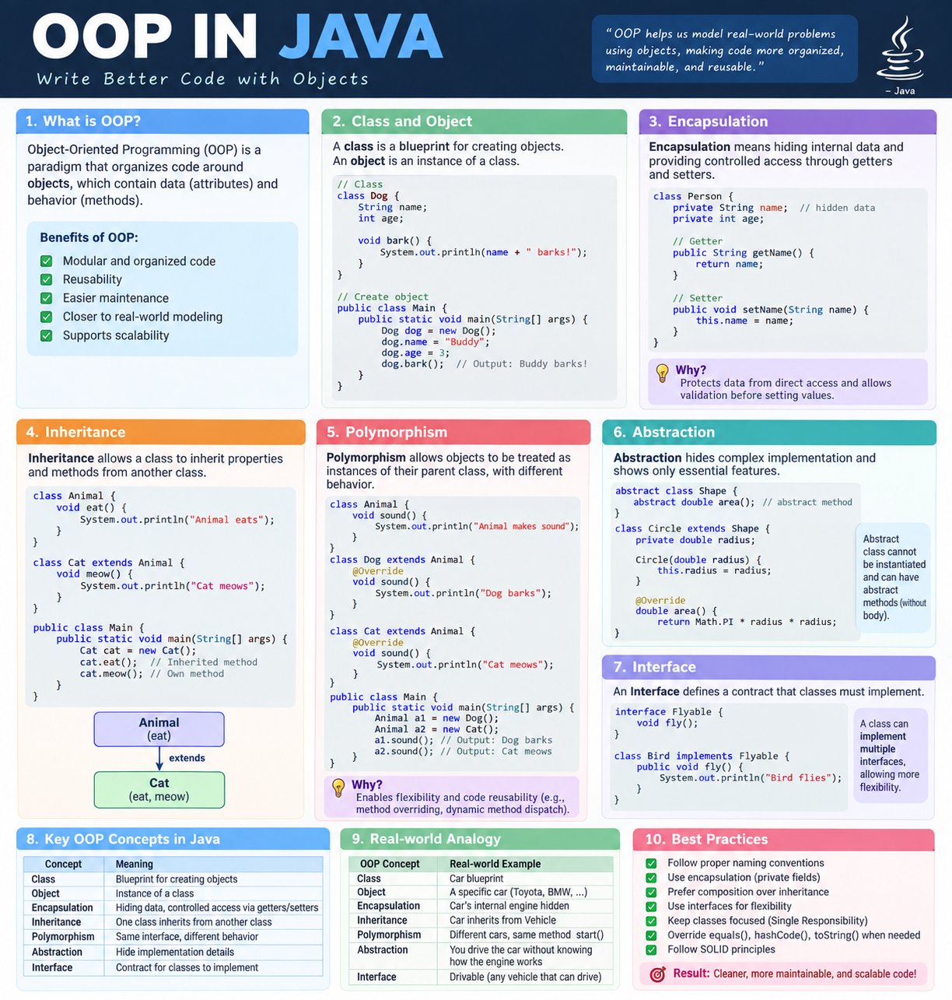
*Object-Oriented Programming (OOP)*

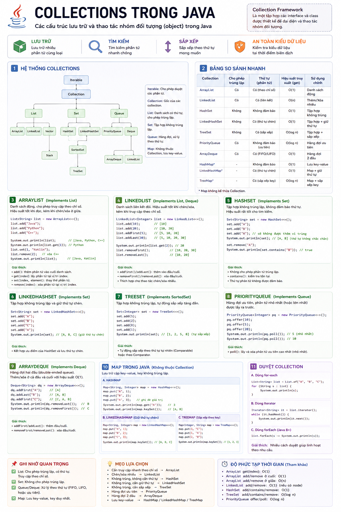
*Java Collections Framework*

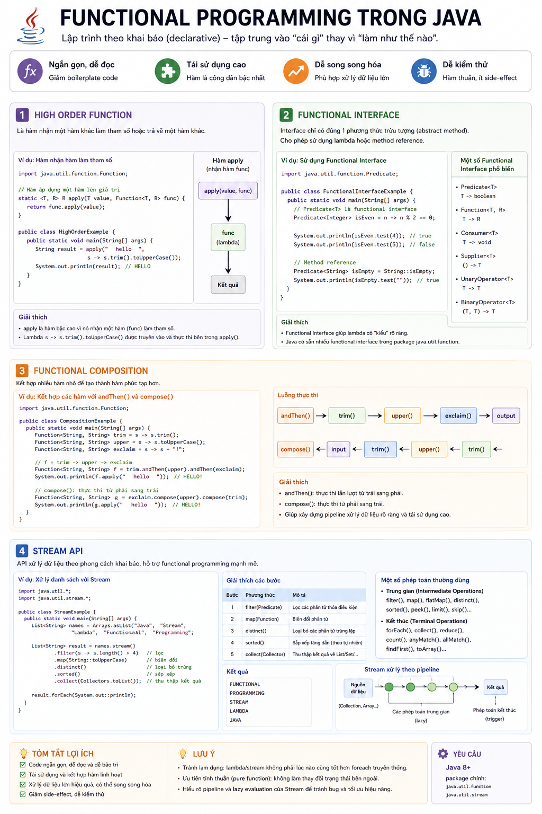
*Functional Programming in Java*

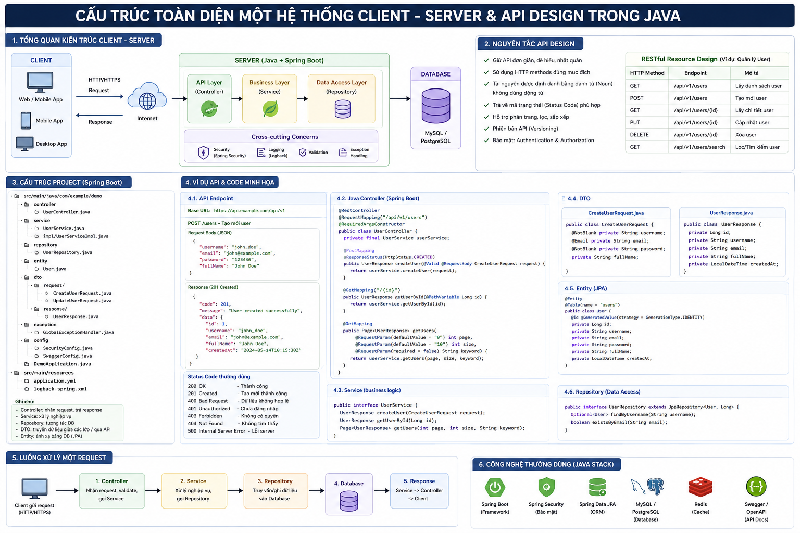
*API Implementation Concept*

---

### 2. Spring Boot Framework & Backend Architecture

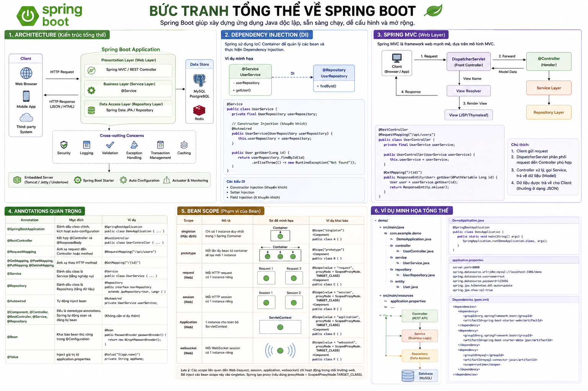
*Spring Boot Overview*

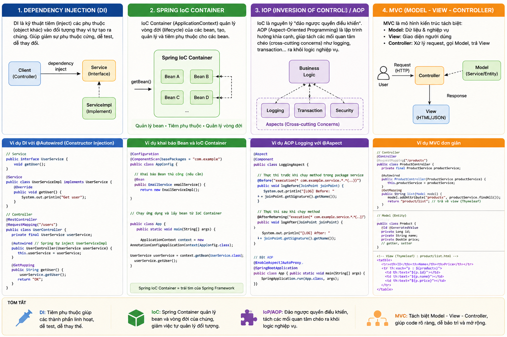
*Dependency Injection (DI), IoC & MVC Pattern*

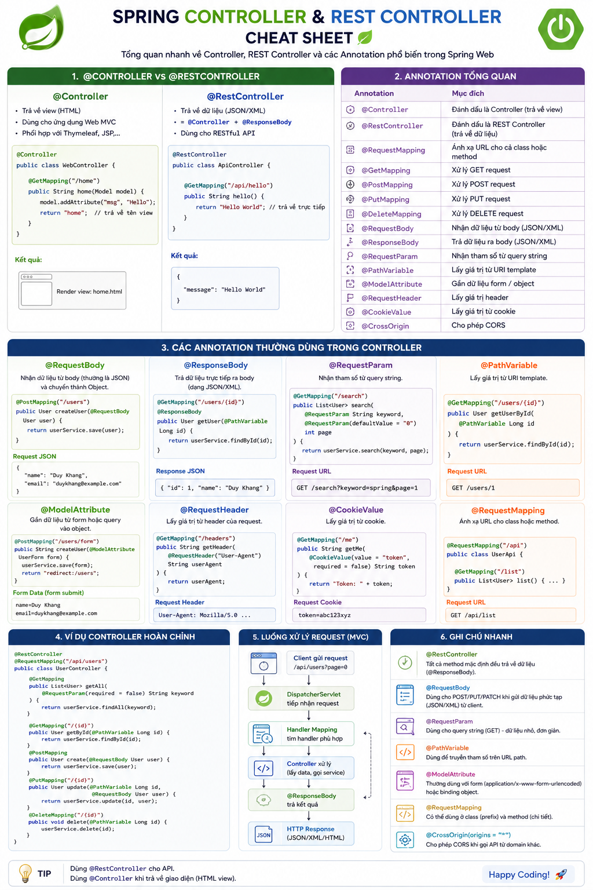
*Controller Architecture*

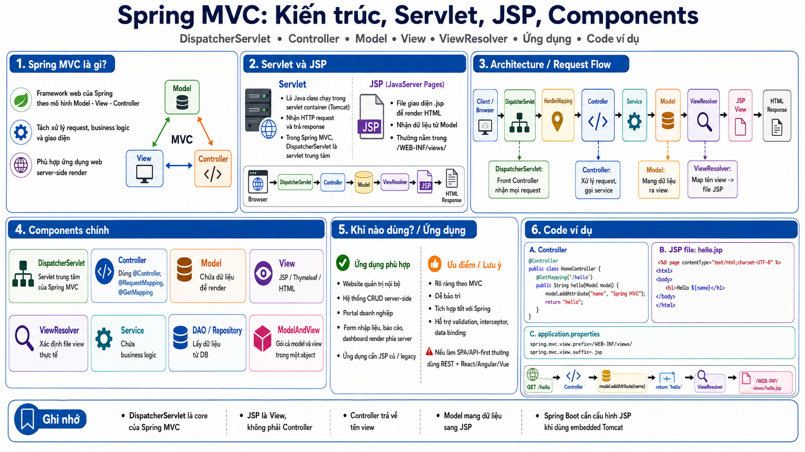
*Spring MVC Workflow*

*Hibernate ORM*

*Spring Data JPA Integration*

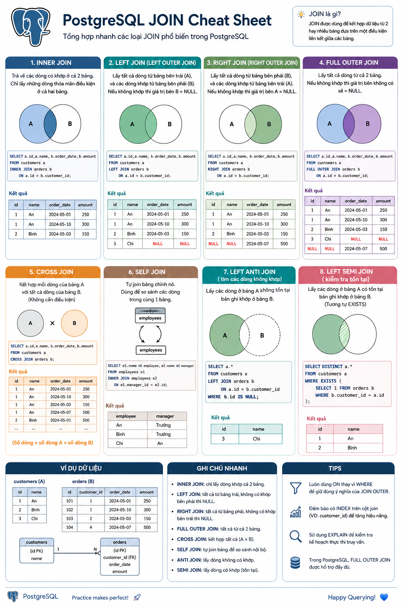
*PostgreSQL Database Integration*

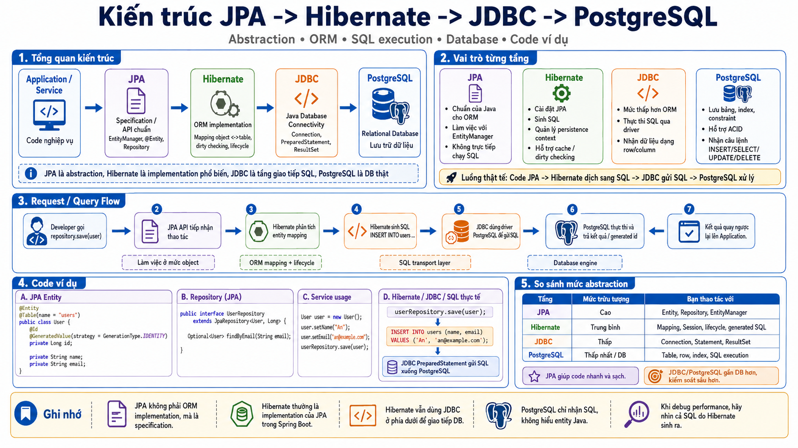
*Data Layer Architecture*

*Spring Security Architecture*

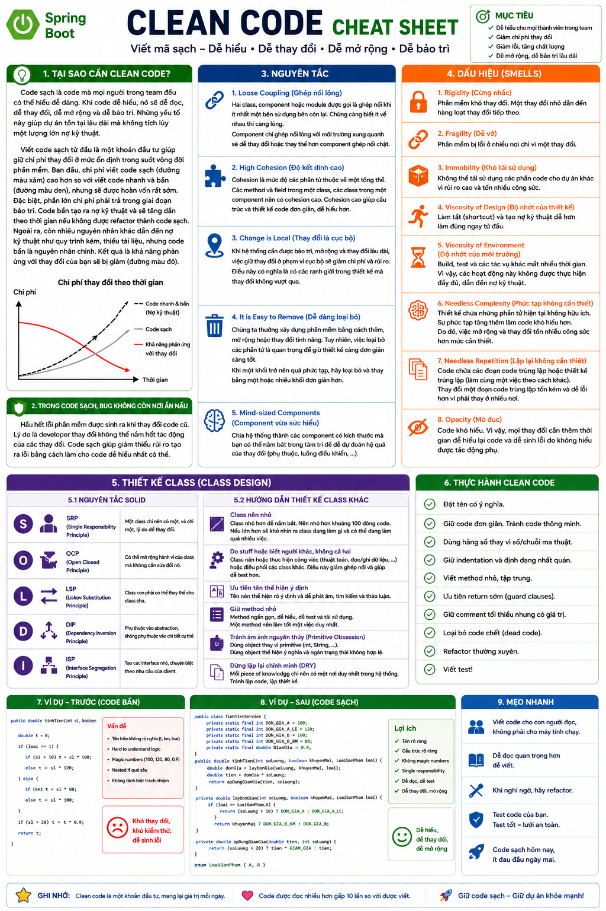
*Clean Code Principles*

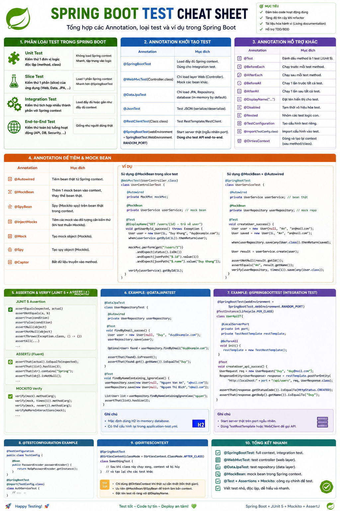
*Spring Boot Testing Architecture*
